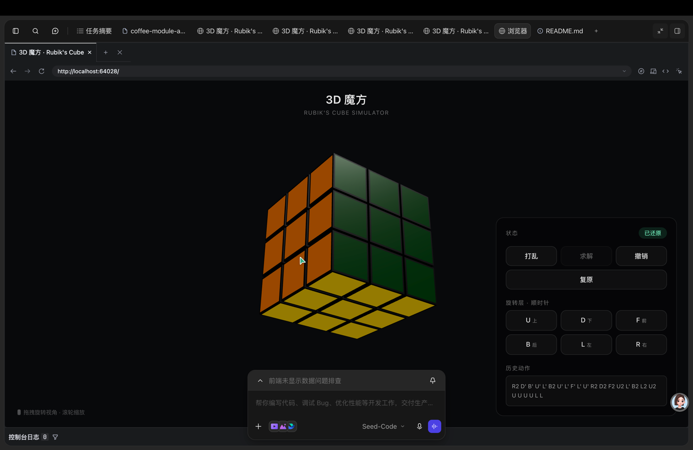
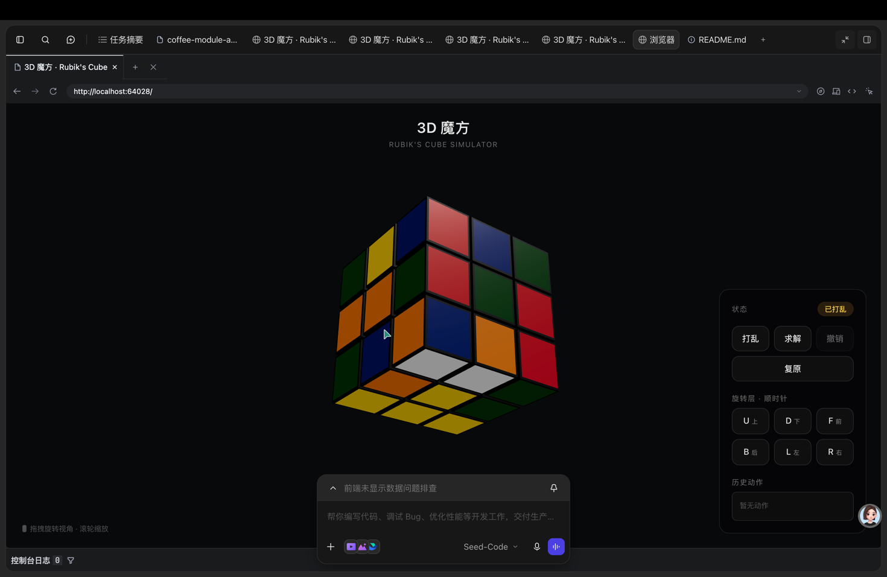
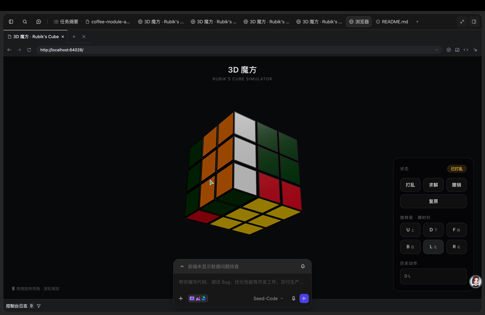

# 🧊 3D 魔方模拟器 (Rubik's Cube 3D)

一个基于 React + Three.js 构建的沉浸式 3D 魔方交互模拟器。具备真实的物理视觉效果、流畅的层旋转动画和完整的状态管理功能。

<div align="center">
  
  <p align="center"><em>还原状态的 3D 魔方</em></p>
</div>

## ✨ 核心特性

- **真实 3D 渲染**: 基于 React Three Fiber 实现的 WebGL 3D 场景
- **层旋转动画**: 正确的 Layer Pivot Group 架构，绕魔方中心旋转，而非绕自身
- **6 个面旋转**: 支持 U (上)、D (下)、F (前)、B (后)、L (左)、R (右) 6 个面的顺时针旋转
- **智能打乱**: 生成符合规则的随机打乱序列
- **自动求解**: 基于逆向算法还原魔方到初始状态
- **撤销操作**: 支持无限步撤销
- **圆周运动插值**: 使用三角函数进行旋转路径插值，而非线性插值，动画更自然
- **响应式 UI**: 基于 Tailwind CSS 的现代化控制面板

## 🛠 技术栈

| 类别 | 技术 |
|------|------|
| **前端框架** | React 18 + TypeScript |
| **3D 渲染** | Three.js + React Three Fiber (R3F) |
| **3D 辅助** | @react-three/drei (OrbitControls) |
| **状态管理** | Zustand |
| **构建工具** | Vite 5 |
| **样式** | Tailwind CSS 3 |
| **动画** | Framer Motion |

## 📁 项目结构

```
src/
├── App.tsx                 # 主应用组件
├── main.tsx                # 入口文件
├── index.css               # 全局样式
├── components/
│   ├── Scene.tsx           # Three.js 场景容器（Canvas、灯光、控制器）
│   ├── Cube.tsx            # 魔方整体组件（管理 27 个 Cubie 的渲染）
│   ├── Cubie.tsx           # 单个小方块组件（黑色主体 + 彩色贴纸）
│   └── ControlPanel.tsx    # 控制面板（打乱、求解、旋转按钮）
├── cube/
│   ├── state.ts            # 魔方核心数据结构（Cubie、Vec3、状态生成）
│   └── rotation.ts         # 旋转算法（向量旋转、连续旋转、打乱生成）
└── store/
    └── cubeStore.ts        # Zustand 全局状态（动画状态、历史记录、提交逻辑）
```

## 🏗️ 核心实现原理

### 1. 三维坐标系定位

魔方使用右手坐标系进行定位，27 个小方块的坐标范围为 [-1, 0, 1]。

<div align="center">
  
  <p align="center"><em>三维坐标系与面的对应关系</em></p>
</div>

**坐标与面的对应关系：**
- X 轴：-1 = L (左)，+1 = R (右)
- Y 轴：-1 = D (下)，+1 = U (上)
- Z 轴：-1 = B (后)，+1 = F (前)

### 2. 层旋转架构 (Layer Pivot Group)

传统方式直接对单个小方块施加旋转，导致旋转中心为方块自身而非魔方中心。本项目采用**数据驱动 + 圆周运动**的方式：

```
错误方式:
  Cubelet.rotation.x += 90deg  → 绕自身中心旋转，导致"散开"

正确方式:
  1. 筛选该层的 9 个 Cubie
  2. 对每个 Cubie 的位置向量施加旋转变换（圆周运动）
  3. 更新 Cubie 的朝向（贴纸方向同步）
  4. 动画结束后，将新的位置和朝向写入状态
```

### 3. 小方块结构

每个魔方由 27 个小方块（Cubie）组成，每个小方块包含黑色主体和彩色贴纸。

<div align="center">
  
  <p align="center"><em>魔方小方块分解视图</em></p>
</div>

<div align="center">
  
  <p align="center"><em>小方块组装结构</em></p>
</div>

**贴纸绑定结构：**

```
Cubie (group)
├── BoxGeometry (黑色主体)
├── StickerGroup (rotation=FACE_ROTATION[F])
│   └── StickerMesh (position=[0,0,0.49])
├── StickerGroup (rotation=FACE_ROTATION[B])
│   └── StickerMesh (position=[0,0,0.49])
└── ... (U, D, L, R 面同理)
```

### 4. 圆周运动插值

使用三角函数而非线性插值，使旋转动画更加自然：

```typescript
// 连续旋转函数：绕轴旋转任意角度
function rotateContinuous(v, axis, angle) {
  const c = Math.cos(angle);
  const s = Math.sin(angle);
  if (axis === "y") return [z*s + x*c, y, z*c - x*s];
  // ...其他轴
}
```

### 5. 动画状态管理

使用 Zustand 存储动画前后的位置快照，实现平滑过渡：

```typescript
// 动画状态包含：
{
  prevPositions: Vec3[],      // 旋转前所有 cubie 的位置
  targetPositions: Vec3[],     // 旋转后所有 cubie 的位置
  progress: number,           // 0→1 的动画进度
  face: "U" | "D" | ...,      // 旋转的面
  times: number                // 旋转次数
}
```

## 🚀 快速开始

### 环境要求

- Node.js >= 18
- npm >= 9

### 安装与运行

```bash
# 1. 克隆项目
git clone <repository-url>
cd rubiks-cube-3d

# 2. 安装依赖
npm install

# 3. 启动开发服务器
npm run dev

# 4. 打开浏览器访问
# http://localhost:5173
```

### 构建与部署

```bash
# 生产环境构建
npm run build

# 预览构建产物
npm run preview
```

## 🎮 使用说明

### 主界面

<div align="center">
  
  <p align="center"><em>深色主题的主界面，包含 3D 场景和控制面板</em></p>
</div>

### 控制面板按钮

| 按钮 | 功能 |
|------|------|
| **打乱** | 随机生成 20 步打乱序列并执行 |
| **求解** | 自动执行逆向算法还原魔方 |
| **撤销** | 撤销上一步操作 |
| **复原** | 重置到初始还原状态 |
| **U 上** | 顺时针旋转上层 |
| **D 下** | 顺时针旋转下层 |
| **F 前** | 顺时针旋转前层 |
| **B 后** | 顺时针旋转后层 |
| **L 左** | 顺时针旋转左层 |
| **R 右** | 顺时针旋转右层 |

### 打乱效果

<div align="center">
  
  <p align="center"><em>打乱后的魔方状态</em></p>
</div>

### 单层旋转测试

<div align="center">
  
  <p align="center"><em>执行 "D" 旋转后的效果</em></p>
</div>

### 3D 视角控制

- **鼠标左键拖拽**: 旋转视角
- **鼠标滚轮**: 缩放
- **最小缩放**: 5 单位
- **最大缩放**: 16 单位

## 📐 数据结构

### Cubie (小方块)

```typescript
interface Cubie {
  position: [number, number, number];  // 坐标 (-1, 0, 1)
  colors: Partial<Record<Face, Color>>; // 各面颜色
}
```

### 标准配色

| 面 | 颜色 | 色值 |
|----|------|------|
| U (上) | 白色 | #f8f8f8 |
| D (下) | 黄色 | #ffd60a |
| F (前) | 绿色 | #1b5e20 |
| B (后) | 蓝色 | #1e3a8a |
| L (左) | 橙色 | #ff8f00 |
| R (右) | 红色 | #e53935 |

## 📚 架构图解

```
┌─────────────────────────────────────────────────────┐
│                    App.tsx                           │
│  ┌─────────────────────────────────────────────┐    │
│  │              Scene.tsx                       │    │
│  │  ┌─────────────────────────────────────┐    │    │
│  │  │         Three.js Canvas              │    │    │
│  │  │  ┌─────────────────────────────┐    │    │    │
│  │  │  │        Cube.tsx             │    │    │    │
│  │  │  │  ┌───┐ ┌───┐ ┌───┐         │    │    │    │
│  │  │  │  │Cubie│ │Cubie│ │Cubie│  ...  │    │    │    │
│  │  │  │  └───┘ └───┘ └───┘         │    │    │    │
│  │  │  └─────────────────────────────┘    │    │    │
│  │  └─────────────────────────────────────┘    │    │
│  └─────────────────────────────────────────────┘    │
│                                                     │
│  ┌─────────────────────────────────────────────┐    │
│  │         ControlPanel.tsx                    │    │
│  │    [打乱] [求解] [撤销] [复原]               │    │
│  │    [U] [D] [F] [B] [L] [R]                  │    │
│  └─────────────────────────────────────────────┘    │
│                                                     │
│  ┌─────────────────────────────────────────────┐    │
│  │    Zustand Store (cubeStore.ts)             │    │
│  │  ├── cubies: Cubie[]                        │    │
│  │  ├── animation: AnimationState              │    │
│  │  ├── history: Move[]                        │    │
│  │  └── playMove(), undo(), scramble()...      │    │
│  └─────────────────────────────────────────────┘    │
└─────────────────────────────────────────────────────┘
```

## 📝 License

MIT License
